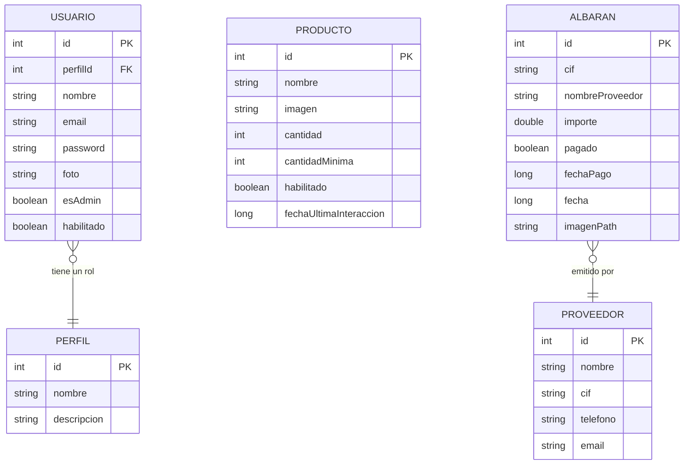

# ControlAlmacen
App Móvil creada con la finalidad de facilitar el control de entradas y salidas de productos de almacenes de pequeñas empresas. Proyecto creado por Giselle Santos y Álvaro Prado.

## Estructura de la Base de Datos (Room)

A continuación se detalla el diseño de la base de datos relacional utilizada en el proyecto:

### Entidades Principales
- **Usuarios**: Gestión de acceso y roles (Admin/User).
- **Productos**: Control de inventario y stock mínimo.
- **Albaranes**: Registro de facturas y pagos a proveedores.
- **Proveedores**: Información de contacto de suministradores.
- **Perfiles**: Definición de roles del sistema.
